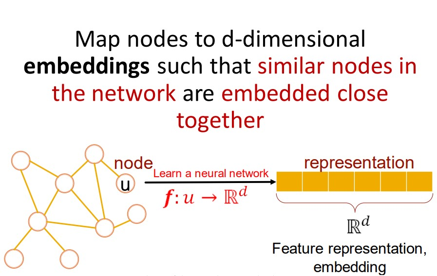

# Introduction: Machine Learning for Graphs

[The original link](http://web.stanford.edu/class/cs224w/slides/01-intro.pdf)

## Graphs

Graphs are general language for describing and analyzing entities with relations/ interactions.

Types:

 - Event Graphs
 - Computer Networks (pc - laptop - router - etc..)
 - Disease Pathways (DAXX - ABCB1 - CDKN2A - EGFR - ...)
 - Food Webs (`prey_x` - `predator_y` - ...)
 - Particle Networks 
 - Undergound Netwroks (Subway / Skytrain stations)
 - Social Networks
 - ....

Complex domains have a rich <b> relational structure </b>, which can be represented as relational graph.

Graphs are the new frontier of deep learning, as it connect things.

<b>Networks are complex</b>

- Arbitrary size and complex topological structure (i.e. no spatial locality like grids)

- No fixed node ordering or reference point
- Often dynamic and have multimodal features

Map nodes to d-dimensional **embeddings** such that similar nodes in the network are embedded close together.

<b>Different Types of Tasks</b>

- **Node classification**: Predict a property of node
  * Ex: categorize online users/ items
- **Link prediction**: Predict whether there are missing links between two nodes.
  * Ex: Knowledge graph completion
- **Graph classification**: Categorize different graphs
  * Ex: Molecule property prediction
- **Clustering**: Detect if nodes form a community
  * Example: Social circle detection
- **Other tasks**:
  * Graph generation: Drug discovery
  * Graph evolution: Physical simulation

Example of using one of the above:

Key idea: "Spatial graph"
 - Nodes: Amino acids in protein sequence
 - Edges: Proximity between amino acids (residues)

